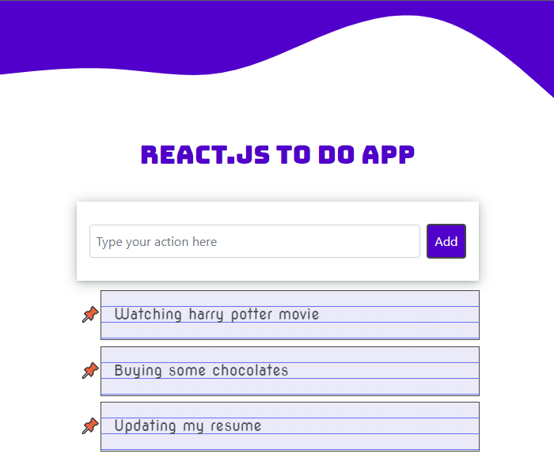

# To do app using React.JS!

Hi! This project is built to help beginners with starting using React.JS by building a simple to do app project using HTML, CSS, JavaScript (ES6), Bootstrap, React.JS to create a cool and responsive to do app and testing their knowledge of React.JS basics.

# Project Requirements:
- Installing latest version of [node js](https://nodejs.org/en/download/) (My node.JS version is 16.14.0).
- Code Editor: I have used [VS Code](https://code.visualstudio.com) as my text editor you can use any text editor you like.
- After having the above requirements simply open your terminal in todoapp directory then type the following command (npm start) to run the server on your local machine.

# Try it yourself by clicking [here](https://zen-sinoussi-88d997.netlify.app)

# Screenshot

